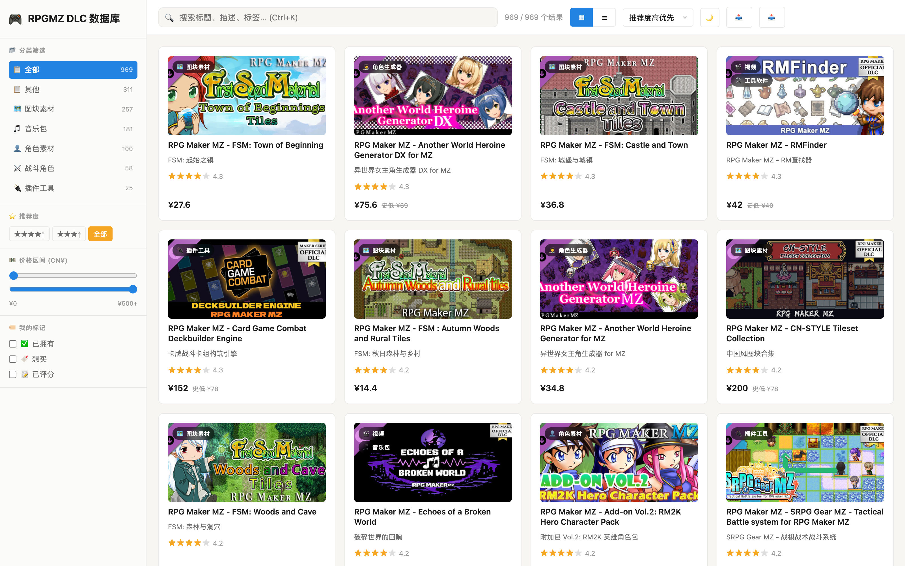
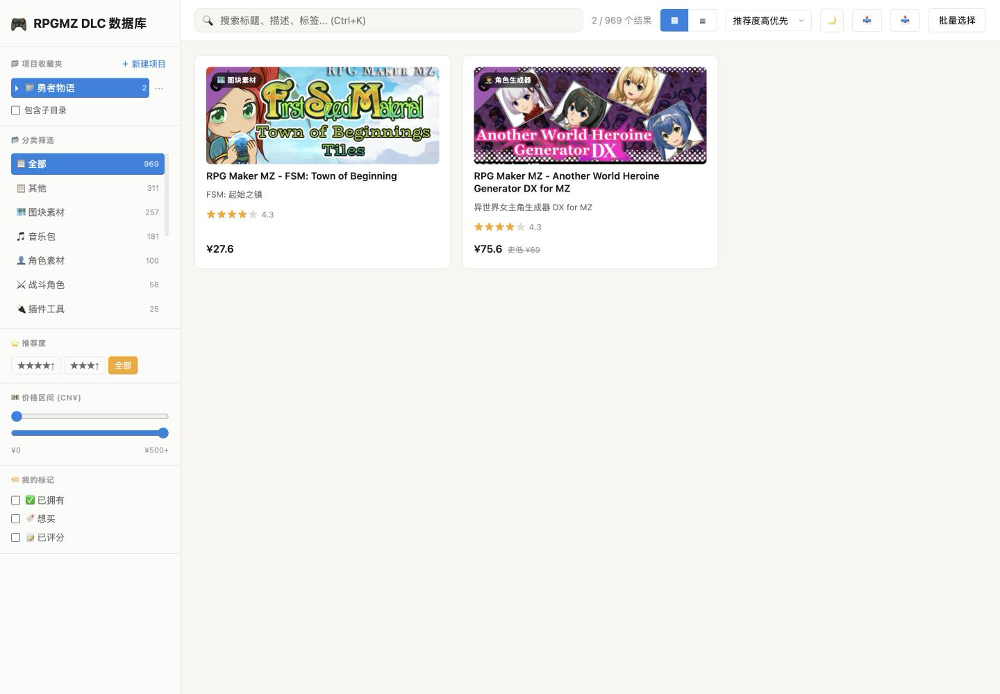
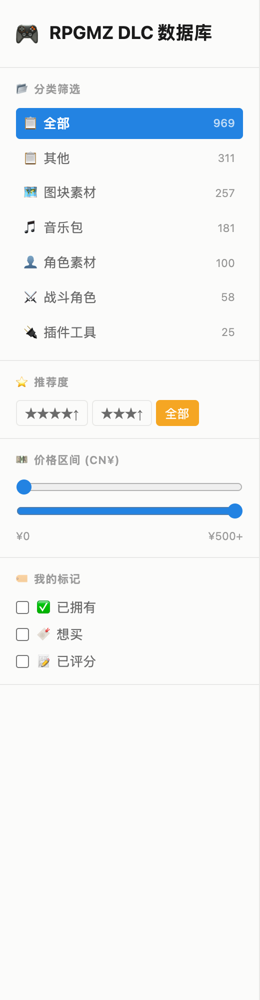
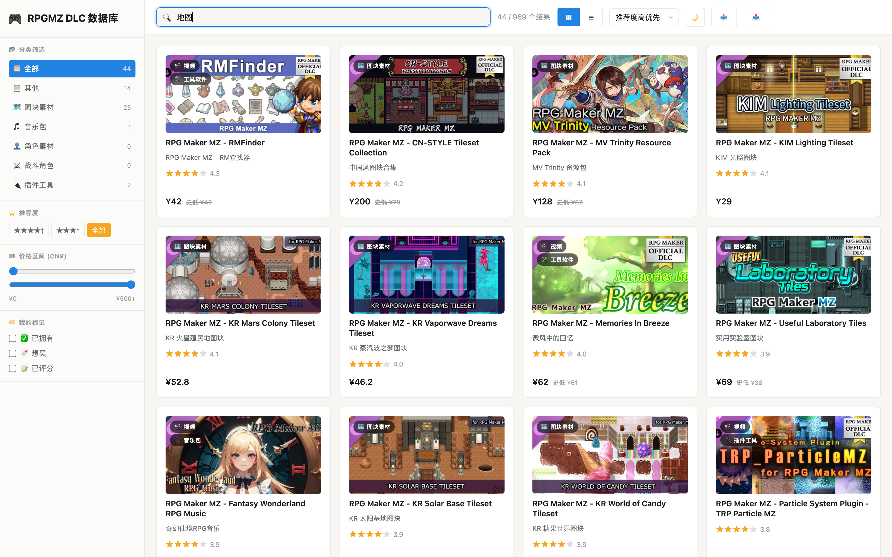
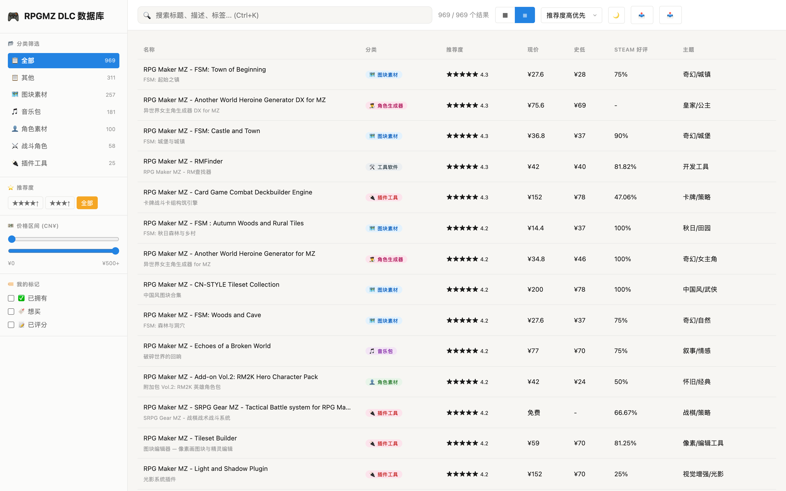
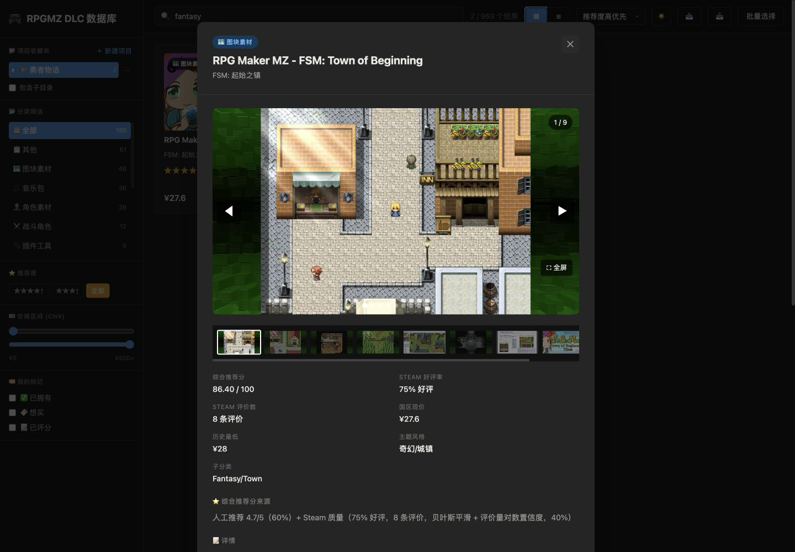
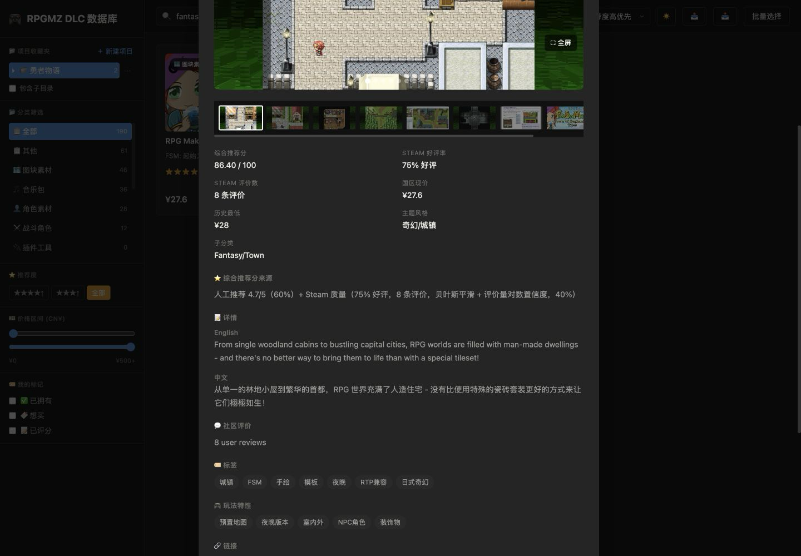
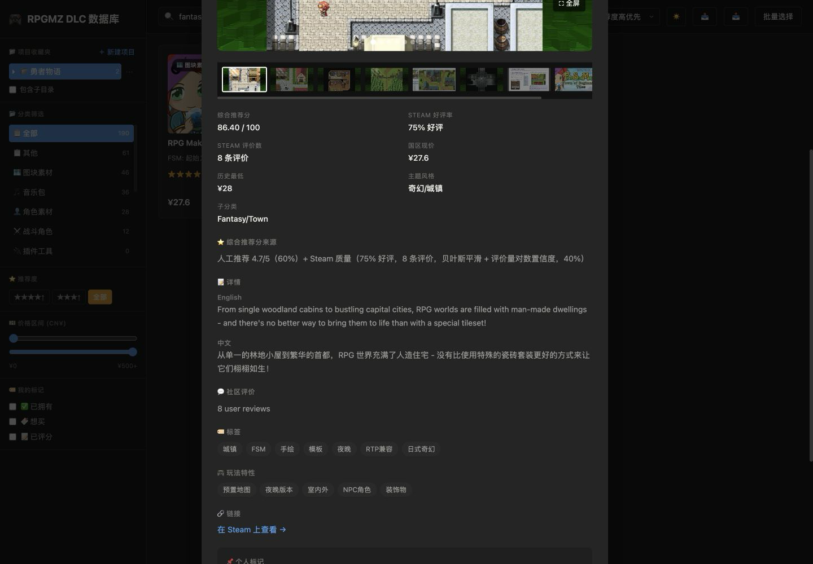
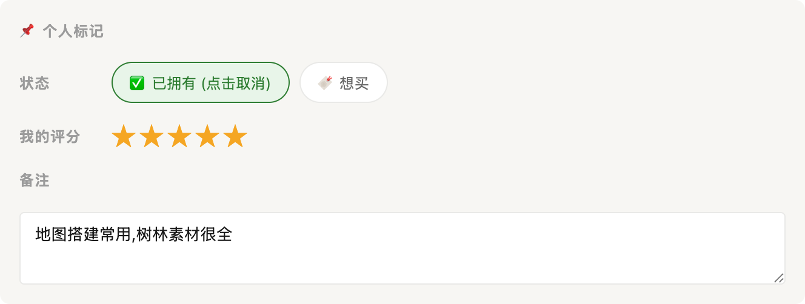
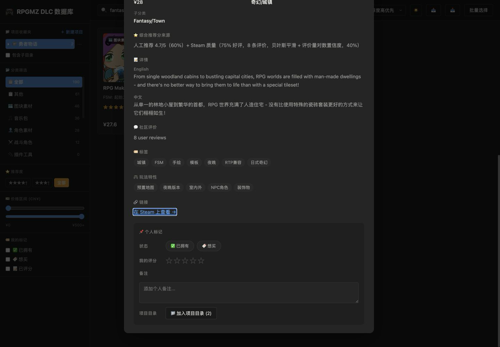

<div align="center">

# 🎮 RPGMZ DLC 数据库

**一个专为 RPG Maker MZ 玩家打造的 DLC 浏览 / 筛选 / 个人收藏管理工具**

969 款官方 DLC,一网打尽——不用再在 Steam 商店里翻到眼花

[English](README_EN.md) | 简体中文

[🌐 在线体验](https://subatxax-cell.github.io/rpgmaker-mz-dlc-db/) ·
[📦 查看源码](https://github.com/subatxax-cell/rpgmaker-mz-dlc-db)

**当前版本：v1.1.0** · [查看更新记录](CHANGELOG.md)

</div>

---

## 📽️ 宣传片


*(点击上方图片下载观看完整宣传片,约 30MB)*

## 📁 项目收藏夹

左侧可新建游戏项目和无限层级子目录，并从 DLC 详情页或批量选择模式把素材加入多个目录。项目数据仅保存在当前浏览器；导出备份会同时包含个人标记、项目树和归类关系，也兼容旧版个人数据备份。删除项目或目录只会移除归类关系，不会删除 DLC 或“已拥有／想买”、评分和备注。

---

## 💡 为什么做这个

我是一个 RPG Maker MZ 爱好者,但每次打开 Steam 商店翻 DLC 都会犯难——**光是官方 DLC 就有 900 多款**,图块、角色、音乐、插件混在一起,想找一款"值得买"的素材包,得一个个点开看评价、看价格、看主题,非常低效。

所以我做了这个小工具:把全部 969 款 RPG Maker MZ DLC 聚合到一个页面里,支持按分类/主题/标签筛选,结合 Steam 好评率算出综合推荐分,四星筛选一键选出最值得下载的那批,还能标记自己"已拥有""想买"——**简单、小巧、高效**,就是我自己每天在用的那个版本。

## ✨ 功能一览

### 1. 全量聚合浏览,明暗双主题

969 款 DLC 一屏卡片墙,支持随时切换明/暗主题。




### 2. 多维度筛选

按分类(图块素材/角色素材/音乐包/插件工具/战斗角色/其他)、推荐度星级、价格区间、个人标记(已拥有/想买/已评分)组合筛选。



### 3. 全文搜索

标题、描述、标签都能搜,输入即时过滤。



### 4. 卡片 / 表格双视图

信息密度不够?一键切到表格视图,批量对比价格、好评率、主题。



### 5. 详情弹窗:一眼看懂值不值

综合推荐分、Steam 好评率与评价数、国区现价与历史最低价、主题风格、子分类,全部摆在一起对比。



推荐分怎么算的也不藏着——来源公式直接展示,人工推荐分和 Steam 好评质量各占比多少一目了然。



### 6. 中英双语详情

每款 DLC 的介绍同时提供英文原文和中文翻译,不用来回切 Steam 商店语言。



### 7. 标签系统

每款 DLC 都打好了主题/风格标签(奇幻、像素、复古、JRPG……),点开详情就能看到,方便按调性找素材。全项目一共用到了 **410 个标签**,完整列表见下方。


### 8. 个人收藏标记

自己标记"已拥有""想买",打个人评分、写备注——数据存在本地浏览器里,只属于你自己。



### 9. 一键跳转 Steam 原页面

看中了就直接跳转官方商店页面购买,不用自己搜。



---

## 🏷️ 全部标签(410 个)

<details>
<summary>点击展开查看全部标签</summary>

`16位`, `2D`, `2Way`, `3D`, `3DS`, `80年代`, `8bit`, `8方向移动`, `90年代`, `ARPG`, `AVG`, `Ax Angel`, `BGM`, `BOSS`, `BOSS场景`, `Ben Carter`, `Chiptune`, `DQ风格`, `DS`, `DX`, `EX`, `Effekseer`, `FC风格`, `FES`, `FSM`, `GBA`, `Gee-kun-soft`, `JRPG`, `Joel Steudler`, `KR`, `Kawaii`, `Krachware`, `MV`, `NPC`, `Persona`, `Press Turn`, `QTE`, `REFMAP`, `RM2k`, `RTP兼容`, `RTP扩展`, `SERIALGAMES`, `SFC`, `SRPG`, `SV`, `TCG`, `TRPG`, `Time Fantasy`, `Topdown`, `Trinity`, `UI`, `VN`, `Winlu`, `ayato`, `deckbuilder`, `roguelike`, `东方`, `中世纪`, `中国风`, `主角`, `乡村`, `书籍`, `事件`, `互动`, `交通工具`, `仙侠`, `仙境`, `休闲`, `传奇`, `传统`, `伤害弹出`, `侦探`, `侧视`, `侧视战斗`, `俯视`, `像素`, `像素画`, `像素艺术`, `儿童`, `儿童向`, `元素`, `光影`, `光照`, `免版税`, `免费`, `入门`, `公主`, `兽娘`, `兽耳`, `冒险`, `军事`, `军装`, `冰冻`, `冰雪`, `凯尔特`, `分支叙事`, `制服`, `剧情`, `动作`, `动作战斗`, `动态光源`, `动漫`, `动物`, `动画`, `卡牌`, `卷轴`, `压抑`, `原型`, `双屏`, `反乌托邦`, `反派`, `发型`, `变奏`, `叙事`, `口袋`, `古装`, `可爱`, `可视化编辑`, `史诗`, `合唱`, `合成器`, `合成波`, `后末日`, `吸血鬼`, `和风`, `咒语`, `哥特`, `哨笛`, `商店`, `回合制`, `图块编辑`, `图标`, `圣诞市场`, `地下城`, `地形效果`, `地牢`, `埃及`, `城堡`, `城墙`, `城市`, `城镇`, `基地`, `基础`, `塔楼`, `复古`, `复古未来`, `多种职业`, `夜晚`, `大型项目`, `大量`, `天使`, `天气`, `太空`, `太空船`, `太阳能`, `头盔`, `奇妙`, `奇幻`, `奇幻职业`, `女主角`, `女性`, `孩子`, `宅男`, `宏大`, `宗教`, `实时战斗`, `实验室`, `室内`, `室外`, `宫殿`, `对话`, `寺庙`, `封面`, `射击`, `小提琴`, `尾巴`, `山谷`, `岩浆`, `工具`, `巴伐利亚`, `幽灵船`, `废墟`, `异世界`, `异星`, `弱点系统`, `彩色`, `彩色玻璃`, `得分系统`, `德国`, `必入`, `必备`, `怀旧`, `怪物`, `恐怖`, `恐惧`, `悬疑`, `情怀`, `情感`, `战士`, `战斗`, `战斗特效`, `战斗系统`, `战术`, `战棋`, `户外`, `房屋`, `房间`, `手绘`, `扩展`, `抽牌`, `按键`, `掌机`, `探索`, `控制室`, `推理`, `提示`, `搜索`, `搞笑`, `摇滚`, `操作感`, `敌人`, `教堂`, `斩击`, `新手`, `施法`, `旅行`, `旋律`, `日常`, `日式`, `日式奇幻`, `日系`, `时机`, `明亮`, `昼夜`, `暗黑`, `暗黑奇幻`, `服装`, `末世`, `末日`, `机库`, `机械`, `机甲`, `杂乱`, `村庄`, `极地`, `柔和`, `桌游`, `梦幻`, `森林`, `模拟`, `模板`, `欢快`, `欧洲`, `正视战斗`, `武侠`, `武器`, `武士`, `殖民地`, `氛围`, `水母`, `沉浸`, `沙漠`, `治愈`, `法师`, `洞穴`, `海怪`, `海洋`, `海盗`, `深沉`, `混合玩法`, `温暖`, `温馨`, `激昂`, `激烈`, `火山`, `火星`, `火焰`, `火焰纹章`, `火车`, `灯光`, `爆炸`, `爵士`, `物品`, `特效`, `状态`, `独特`, `王子`, `王座厅`, `现代`, `甜点`, `生存`, `生成器`, `田园`, `电子`, `男性`, `界面`, `疯狂`, `皇室`, `盔甲`, `真女神转生`, `研究`, `神圣`, `神秘`, `秋天`, `科学`, `科幻`, `科技`, `窗口皮肤`, `窗户光`, `竖琴`, `童话`, `竹林`, `策略`, `管弦`, `管弦乐`, `粒子`, `精灵`, `精灵编辑`, `精神病院`, `糖果`, `素材`, `紧张`, `紫色`, `经典`, `经典RPG`, `经典恐怖`, `维多利亚`, `综合`, `综合素材`, `绿洲`, `网格`, `网格战斗`, `翅膀`, `胶囊`, `自定义`, `自然`, `舒适`, `航海`, `船`, `船战`, `节奏`, `英雄`, `草原`, `菜单`, `蒸汽`, `蒸汽朋克`, `蒸汽波`, `蒸汽火车`, `蘑菇`, `行走图`, `街道`, `补充`, `装备可视化`, `覆盖层`, `视觉小说`, `角`, `角色动画`, `角色生成器`, `角色精灵`, `诡异`, `调查`, `调试`, `豪华`, `赛博朋克`, `赛博格`, `车厢`, `车站`, `转生`, `轻松`, `边框`, `近未来`, `连击`, `迷你`, `迷宫`, `通用`, `道士`, `遗迹`, `都市`, `配套`, `酒馆`, `重编曲`, `野兽`, `金字塔`, `钢琴`, `铁路`, `铁轨`, `铠甲`, `闪电`, `闪避`, `队友`, `阴影`, `阴暗`, `附加`, `陷阱`, `霓虹`, `面孔图`, `音乐`, `音效`, `音游`, `项目管理`, `骑士`, `骰子`, `高清`, `高科技`, `魔法`, `魔法书`, `魔王`, `鱼类`, `鸟居`, `黑暗`

</details>

---

## 🛠️ 技术说明

纯前端静态网页,无需后端服务:

- 原生 HTML / CSS / JavaScript,无框架依赖
- [Fuse.js](https://www.fusejs.io/) 做模糊搜索
- 个人标记(已拥有/想买/评分/备注)存储在浏览器 `localStorage`,数据只在你自己的设备上,不会上传到任何服务器
- 数据来源于 Steam 商店公开信息,定期通过脚本同步

## 🚀 本地运行

```bash
git clone https://github.com/subatxax-cell/rpgmaker-mz-dlc-db.git
cd rpgmaker-mz-dlc-db
python3 -m http.server 8080
# 打开 http://localhost:8080
```

## ⚠️ 声明

本项目为个人爱好者作品,与 KADOKAWA / Gotcha Gotcha Games(RPG Maker 官方)、Valve(Steam)均无关联。DLC 数据、价格、评分均来自 Steam 商店公开页面,仅供参考,请以 Steam 官方页面为准。
