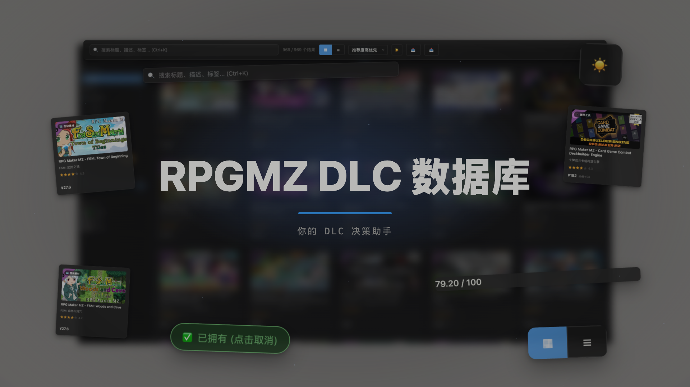

<div align="center">

# 🎮 RPGMZ DLC Database

**A browsing / filtering / personal-collection tool built for RPG Maker MZ players**

969 official DLCs in one place — stop scrolling through the Steam store one tab at a time

English | [简体中文](README.md)

[🌐 Live Demo](https://subatxax-cell.github.io/rpgmaker-mz-dlc-db/) ·
[📦 Source](https://github.com/subatxax-cell/rpgmaker-mz-dlc-db)

</div>

---

## 📽️ Promo Video

<!-- TODO: drag docs/media/promo.mp4 into the GitHub web editor to get a user-attachments video URL for inline playback -->
<a href="docs/media/promo.mp4">
  
</a>

*(Click the image above to download and watch the full promo video, ~30MB)*

---

## 💡 Why I built this

I'm an RPG Maker MZ hobbyist, and every time I opened the Steam store to browse DLCs I got overwhelmed — **there are over 900 official DLCs alone**, tilesets, character generators, music packs, and plugins all mixed together. Finding one actually worth buying meant clicking into each listing one by one to check reviews, price, and theme. Painfully inefficient.

So I built this: a single page that aggregates all 969 RPG Maker MZ DLCs, filterable by category / theme / tag, with a combined recommendation score derived from Steam review data, a one-click 4-star filter to surface the DLCs actually worth downloading, and personal "owned" / "wishlist" marking. **Simple, small, efficient** — it's the exact tool I use myself every day.

## ✨ Features

### 1. Full catalog browsing, light & dark themes

All 969 DLCs in one card wall, with instant light/dark theme switching.


### 2. Multi-dimensional filtering

Filter by category (tilesets / character assets / music packs / plugins / battler assets / other), recommendation-score stars, price range, and personal marks (owned / wishlist / rated) — all combinable.


### 3. Full-text search

Searches title, description, and tags, filtering as you type.


### 4. Card / table dual view

Need higher information density? Switch to table view to compare price, review rate, and theme side by side.


### 5. Detail modal — is it worth it, at a glance

Recommendation score, Steam review rate & count, current CN-region price vs. historical low, theme, and sub-category — all laid out for comparison.


The scoring formula isn't a black box either — the breakdown between manual curation and Steam review quality is shown right in the modal.


### 6. Bilingual descriptions

Every DLC's description ships in both original English and Chinese translation, no need to flip the Steam store's language setting back and forth.


### 7. Tag system

Every DLC is tagged by theme/style (fantasy, pixel art, retro, JRPG…), visible right in the detail view — handy for browsing by vibe. The whole catalog uses **410 distinct tags**, full list below.


### 8. Personal collection marking

Mark items as "owned" or "wishlist", give your own star rating, jot a note — all stored locally in your own browser, never uploaded anywhere.


### 9. One click to the original Steam page

Found something you like? Jump straight to the official store listing to buy it.


---

## 🏷️ All tags (410)

<details>
<summary>Click to expand the full tag list (tags are in Chinese, matching the app's UI language)</summary>

`16位`, `2D`, `2Way`, `3D`, `3DS`, `80年代`, `8bit`, `8方向移动`, `90年代`, `ARPG`, `AVG`, `Ax Angel`, `BGM`, `BOSS`, `BOSS场景`, `Ben Carter`, `Chiptune`, `DQ风格`, `DS`, `DX`, `EX`, `Effekseer`, `FC风格`, `FES`, `FSM`, `GBA`, `Gee-kun-soft`, `JRPG`, `Joel Steudler`, `KR`, `Kawaii`, `Krachware`, `MV`, `NPC`, `Persona`, `Press Turn`, `QTE`, `REFMAP`, `RM2k`, `RTP兼容`, `RTP扩展`, `SERIALGAMES`, `SFC`, `SRPG`, `SV`, `TCG`, `TRPG`, `Time Fantasy`, `Topdown`, `Trinity`, `UI`, `VN`, `Winlu`, `ayato`, `deckbuilder`, `roguelike`, `东方`, `中世纪`, `中国风`, `主角`, `乡村`, `书籍`, `事件`, `互动`, `交通工具`, `仙侠`, `仙境`, `休闲`, `传奇`, `传统`, `伤害弹出`, `侦探`, `侧视`, `侧视战斗`, `俯视`, `像素`, `像素画`, `像素艺术`, `儿童`, `儿童向`, `元素`, `光影`, `光照`, `免版税`, `免费`, `入门`, `公主`, `兽娘`, `兽耳`, `冒险`, `军事`, `军装`, `冰冻`, `冰雪`, `凯尔特`, `分支叙事`, `制服`, `剧情`, `动作`, `动作战斗`, `动态光源`, `动漫`, `动物`, `动画`, `卡牌`, `卷轴`, `压抑`, `原型`, `双屏`, `反乌托邦`, `反派`, `发型`, `变奏`, `叙事`, `口袋`, `古装`, `可爱`, `可视化编辑`, `史诗`, `合唱`, `合成器`, `合成波`, `后末日`, `吸血鬼`, `和风`, `咒语`, `哥特`, `哨笛`, `商店`, `回合制`, `图块编辑`, `图标`, `圣诞市场`, `地下城`, `地形效果`, `地牢`, `埃及`, `城堡`, `城墙`, `城市`, `城镇`, `基地`, `基础`, `塔楼`, `复古`, `复古未来`, `多种职业`, `夜晚`, `大型项目`, `大量`, `天使`, `天气`, `太空`, `太空船`, `太阳能`, `头盔`, `奇妙`, `奇幻`, `奇幻职业`, `女主角`, `女性`, `孩子`, `宅男`, `宏大`, `宗教`, `实时战斗`, `实验室`, `室内`, `室外`, `宫殿`, `对话`, `寺庙`, `封面`, `射击`, `小提琴`, `尾巴`, `山谷`, `岩浆`, `工具`, `巴伐利亚`, `幽灵船`, `废墟`, `异世界`, `异星`, `弱点系统`, `彩色`, `彩色玻璃`, `得分系统`, `德国`, `必入`, `必备`, `怀旧`, `怪物`, `恐怖`, `恐惧`, `悬疑`, `情怀`, `情感`, `战士`, `战斗`, `战斗特效`, `战斗系统`, `战术`, `战棋`, `户外`, `房屋`, `房间`, `手绘`, `扩展`, `抽牌`, `按键`, `掌机`, `探索`, `控制室`, `推理`, `提示`, `搜索`, `搞笑`, `摇滚`, `操作感`, `敌人`, `教堂`, `斩击`, `新手`, `施法`, `旅行`, `旋律`, `日常`, `日式`, `日式奇幻`, `日系`, `时机`, `明亮`, `昼夜`, `暗黑`, `暗黑奇幻`, `服装`, `末世`, `末日`, `机库`, `机械`, `机甲`, `杂乱`, `村庄`, `极地`, `柔和`, `桌游`, `梦幻`, `森林`, `模拟`, `模板`, `欢快`, `欧洲`, `正视战斗`, `武侠`, `武器`, `武士`, `殖民地`, `氛围`, `水母`, `沉浸`, `沙漠`, `治愈`, `法师`, `洞穴`, `海怪`, `海洋`, `海盗`, `深沉`, `混合玩法`, `温暖`, `温馨`, `激昂`, `激烈`, `火山`, `火星`, `火焰`, `火焰纹章`, `火车`, `灯光`, `爆炸`, `爵士`, `物品`, `特效`, `状态`, `独特`, `王子`, `王座厅`, `现代`, `甜点`, `生存`, `生成器`, `田园`, `电子`, `男性`, `界面`, `疯狂`, `皇室`, `盔甲`, `真女神转生`, `研究`, `神圣`, `神秘`, `秋天`, `科学`, `科幻`, `科技`, `窗口皮肤`, `窗户光`, `竖琴`, `童话`, `竹林`, `策略`, `管弦`, `管弦乐`, `粒子`, `精灵`, `精灵编辑`, `精神病院`, `糖果`, `素材`, `紧张`, `紫色`, `经典`, `经典RPG`, `经典恐怖`, `维多利亚`, `综合`, `综合素材`, `绿洲`, `网格`, `网格战斗`, `翅膀`, `胶囊`, `自定义`, `自然`, `舒适`, `航海`, `船`, `船战`, `节奏`, `英雄`, `草原`, `菜单`, `蒸汽`, `蒸汽朋克`, `蒸汽波`, `蒸汽火车`, `蘑菇`, `行走图`, `街道`, `补充`, `装备可视化`, `覆盖层`, `视觉小说`, `角`, `角色动画`, `角色生成器`, `角色精灵`, `诡异`, `调查`, `调试`, `豪华`, `赛博朋克`, `赛博格`, `车厢`, `车站`, `转生`, `轻松`, `边框`, `近未来`, `连击`, `迷你`, `迷宫`, `通用`, `道士`, `遗迹`, `都市`, `配套`, `酒馆`, `重编曲`, `野兽`, `金字塔`, `钢琴`, `铁路`, `铁轨`, `铠甲`, `闪电`, `闪避`, `队友`, `阴影`, `阴暗`, `附加`, `陷阱`, `霓虹`, `面孔图`, `音乐`, `音效`, `音游`, `项目管理`, `骑士`, `骰子`, `高清`, `高科技`, `魔法`, `魔法书`, `魔王`, `鱼类`, `鸟居`, `黑暗`

</details>

---

## 🛠️ Tech notes

A purely static front-end site, no backend required:

- Vanilla HTML / CSS / JavaScript, no framework
- [Fuse.js](https://www.fusejs.io/) for fuzzy search
- Personal marks (owned / wishlist / rating / notes) are stored in the browser's `localStorage` — data stays on your own device, never uploaded to any server
- Catalog data sourced from public Steam store listings, synced periodically via script

## 🚀 Run locally

```bash
git clone https://github.com/subatxax-cell/rpgmaker-mz-dlc-db.git
cd rpgmaker-mz-dlc-db
python3 -m http.server 8080
# open http://localhost:8080
```

## ⚠️ Disclaimer

This is an independent hobby project, not affiliated with KADOKAWA / Gotcha Gotcha Games (RPG Maker) or Valve (Steam). All DLC data, prices, and ratings are pulled from public Steam store pages for reference only — always defer to the official Steam listing.
